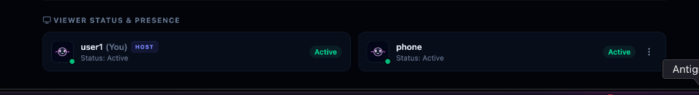
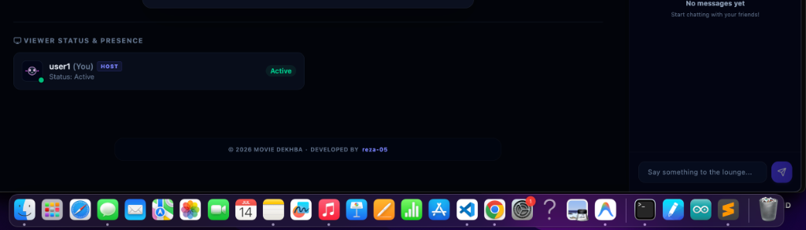
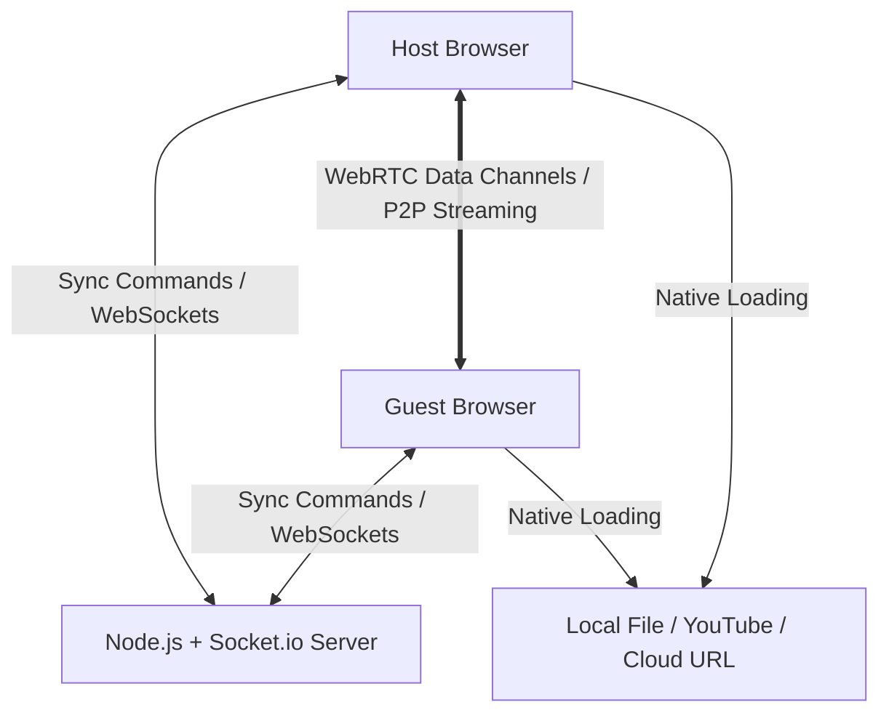

# Movie Dekhba 🍿🎬

[](https://vitejs.dev)
[](https://socket.io)
[](https://tailwindcss.com)
[](https://nodejs.org)

**Movie Dekhba** is a premium, real-time synchronized cinema watch party platform. Designed for friends who want to watch local movie files, direct cloud video URLs, or YouTube links together without lag, complex setups, or subscription walls. 

Leveraging pure peer-to-peer playback synchronization, Movie Dekhba removes the heavy server-bandwidth requirements of screensharing, delivering a lag-free, bufferless 1080p/4K theater experience directly in your browser.

---

## 📸 Interface Preview

### 🏠 Cinematic Landing Screen


### 🎬 Watch Lounge & Interactive Controls


### 📱 Responsive Mobile Sync Layout


---

## 🔥 Key Features

- ⚡ **Zero-Upload Syncing:** Both users select the movie file locally. The HTML5 File API loads the video instantly using a local memory object URL (`URL.createObjectURL`), bypassing server uploads, saving internet bandwidth, and enabling instant start.
- 🔄 **Real-Time Playback Synchronization:** Playback commands (Play, Pause, Seek/Scrub) synchronize between viewers instantly via WebSockets (Socket.io).
- 👁️ **Smart Presence Auto-Pause:** Tracks tab focus and visibility using the Page Visibility API. If any viewer minimizes the browser or switches tabs, the movie automatically pauses for everyone, accompanied by a dynamic toast alert, so no scenes are missed.
- 🔑 **Host Entry Control (Approval Queue):** Protect your room from uninvited guests. Host can enable "Host Approval" mode, prompting a red glowing alert and scale-pulsing viewers badge when guests wait in the queue. Click the badge to open a clean center-modal to Approve or Deny incoming guests.
- 🎨 **Unique Room Avatars & Miniatures:** Dynamically generated SVG avatars based on room join order, ensuring every viewer gets a unique color and style. Avatars are displayed inline next to user names inside the chat bubble list.
- 💬 **Live Chat with Reactions & GIFs:** Premium glassmorphic chat drawer containing Emoji reactions and integrated Giphy GIF searches to react to movie highlights instantly.
- 💾 **Persistent Chat History:** The server persists chat conversations for the duration of the room's lifetime. Returning or late-joining users instantly retrieve the complete chat timeline.
- 🆔 **Device & IP Reconciliation:** Uses persistent device signatures (`localStorage` device ID) to reconcile disconnected users. If a user rejoins under a new name, their record updates in-place without duplicating the room's total viewer count.
- 📱 **Fully Responsive Layout:** Fully optimized for mobile screens. Streamlined font sizing and collapsible presence lists ensure controls and video elements are easily accessible without scrolling.

---

## 🛠️ Tech Stack & Architecture



### Frontend
- **Framework:** React 18 (Vite-powered)
- **Styling:** Tailwind CSS v4 & custom keyframe animations
- **Icons:** Lucide React
- **Real-Time Client:** Socket.io Client

### Backend
- **Runtime:** Node.js
- **Framework:** Express
- **Real-Time Engine:** Socket.io (Room-based namespace isolation)

---

## 🚀 Local Setup & Development

### Prerequisites
- [Node.js](https://nodejs.org/) (v16+ recommended)
- npm (installed automatically with Node.js)

### 1. Run the Backend Server
Navigate to the `server/` directory, install dependencies, and start the development server:
```bash
cd server
npm install
npm run dev
```
*The server will run on `http://localhost:5001`.*

### 2. Run the Frontend Client
Open a new terminal window, navigate to the `client/` directory, install dependencies, and start Vite:
```bash
cd client
npm install
npm run dev
```
*Vite will host the app on `http://localhost:5173` (or `http://localhost:5174` if 5173 is in use).*

---

## 🌐 How to Deploy

### Backend (e.g., Render / Railway / Heroku)
1. Deploy the `server/` directory.
2. Set the `PORT` environment variable (defaults to `5001`).

### Frontend (e.g., Vercel / Netlify / Cloudflare Pages)
1. Deploy the `client/` directory.
2. Set the environment variable `VITE_BACKEND_URL` to point to your deployed backend server address.

---

## 📝 License & Author

Developed with ❤️ by **reza-05** © 2026.
Feel free to fork, open pull requests, or use it for your weekend watch parties!
